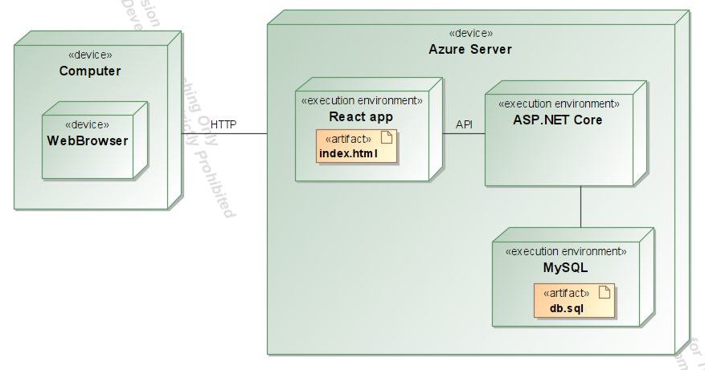

# T120B165-projektas BookHotel
## Sprendžiamo uždavinio aprašymas
### Sistemos paskirtis
Kuriamos sistemos paskirtis - bendra viešbučių platforma, leidžianti klientams lengviau susirasti ir rezervuotis tinkamą viešbučio numerį.

Svetainėje patvirtintos įmonės gali skelbti savo turimų viešbučių siūlomas paslaugas. Prisiregistravęs naudotojas gali užsirezervuoti pasirinkto viešbučio numerį nurodytu laiku, o rezervaciją patvirtina šio viešbučio įmonė.
### Funkciniai reikalavimai
Svečias sistemoje gali:
1. Užsiregistruoti prie platformos;
2. Prisijungti prie platformos;
3. Peržiūrėti miestų sąrašą;
4. Peržiūrėti viešbučių sąrašą;
5. Peržiūrėti viešbučių numerius;

Registruotas naudotojas gali:
1. Pridėti viešbutį;
2. Pridėti viešbučio numerius;
3. Redaguoti, pašalinti savo viešbučio informaciją;
4. Redaguoti, pašalinti savo viešbučio numerio informaciją;

Administratorius sistemoje gali:
1. Pridėti, pašalinti miestą;
3. Redaguoti, pašalinti net kurio viešbučio informaciją;
4. Redaguoti, pašalinti bet kurio viešbučio numerio informaciją;

## Pasirinktų technologijų aprašymas
Pasirinktos technologijos:
- Klientas (angl. front-end) - React js;
- Serveris (angl. back-end) - ASP.NET Core su MySQL duomenų baze;
- Sistema talpinama Microsoft Azure debesyje.
## Sistemos architektūra

